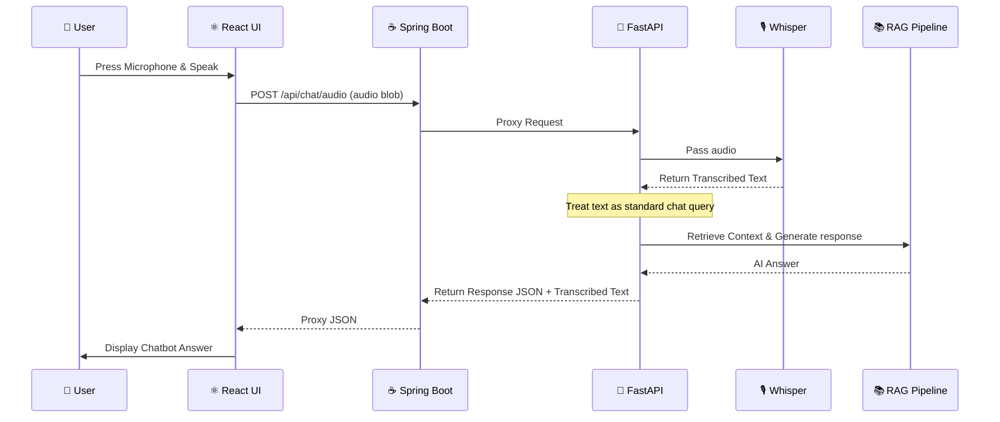

# IMS AstroBot: Voice-to-Text Implementation Guide
*Built and Documented on: April 3, 2026*
*Updated: April 10, 2026*

## 1. How Our Project Works (High-Level Overview)

IMS AstroBot is an Institutional AI Assistant designed to answer questions based on official documents using **RAG** (Retrieval-Augmented Generation). 

The project operates beautifully across a three-tier microservice architecture:

1. **Frontend (React)**: The user interface where students and faculty interact with the chatbot, send messages, and view answers with source citations. 
2. **API Gateway (Spring Boot)**: A central hub built in Java. It handles user authentication, routes data securely, and acts as a firewall between the Frontend and the Backend.
3. **AI Backend (Python FastAPI)**: The core "brain" of the chatbot. 
   - When a user asks a question, this backend searches through institutional documents mathematically stored in a **ChromaDB vector database**.
   - It retrieves the most relevant paragraphs and sends them to a Large Language Model (like Ollama, Groq, or Gemini).
   - The LLM streams back a conversational, accurate answer citing the exact documents used.

---

## 2. Implementing Voice-to-Text with OpenAI Whisper

To make AstroBot more accessible, we integrated the **OpenAI Whisper** model to allow users to speak their questions natively through their browser instead of typing them. We chose `faster-whisper`, a highly optimized version of Whisper that runs locally on your CPU hardware to respect data privacy.

Here is the step-by-step breakdown of how the feature was implemented:

### Flowchart: Audio Journey

### Step 1: Frontend Audio Recording
The microphone workflow is implemented in React chat components (`ChatLayout.jsx` + `ChatInputArea.jsx`).

When the user clicks the mic button:
- The browser uses native **Web Audio API** (`MediaRecorder`) to capture microphone audio.
- Clicking the mic again stops recording.
- The recorded blob is packaged as `multipart/form-data` and posted to `/api/chat/audio` through the existing API service layer.
- The transcribed text is displayed as the user message in chat, followed by the assistant response from the standard RAG pipeline.

The chat input also now uses live API-backed typing suggestions via `/api/suggestions`. The `@Announcement` and `@Database` command hints are shown only for `admin` and `faculty` roles, while students do not see those command hints.

### Step 2: Spring Boot Proxying
Since the React app communicates exclusively with the Spring Boot gateway (handling CORS and login validation), we added a new endpoint (`/api/chat/audio`) in `ChatController.java`. Spring Boot receives the audio file and safely proxies it forward to the Python FastAPI backend natively using Spring `WebClient`.

### Step 3: Python Transcription Service (`rag/voice_to_text.py`)
In the Python backend, we created a new ML service utilizing the `faster-whisper` library. 
- It locally loads the `base.en` Whisper model (which is fast, requiring minimal RAM, but highly accurate for spoken English). 
- We wrapped the model initialization in a Python `@lru_cache` so the AI model stays actively loaded in memory. This ensures that after the first boot-up, transcriptions happen in less than a single second.

### Step 4: Connecting to the RAG Pipeline (`api_server.py`)
Finally, we added the `/api/chat/audio` gateway route to the Python FastAPI server. 
- The server saves the incoming audio file temporarily.
- It passes the incoming file to the Whisper service, which mathematically transcribes the audio into a perfect string of text (e.g., *"What is the attendance policy?"*). 
- This transcribed text is then **seamlessly injected** right into the existing RAG pipeline (retrieving documents and generating an LLM response), exactly as if the user had typed the question manually.
- The transcribed text and the AI's formulated response are packed together and sent back down to the React frontend to display elegantly in the chat interface.

### System Dependencies Overlooked
*   **ffmpeg**: We installed FFmpeg globally via the command line. Whisper strictly requires this system-level multimedia framework to decode various browser audio formats.

***

*By decoupling the audio transcription (Whisper) from the text generation (LLM), we successfully made AstroBot heavily accessible without disrupting any of the system's foundational architecture!*
