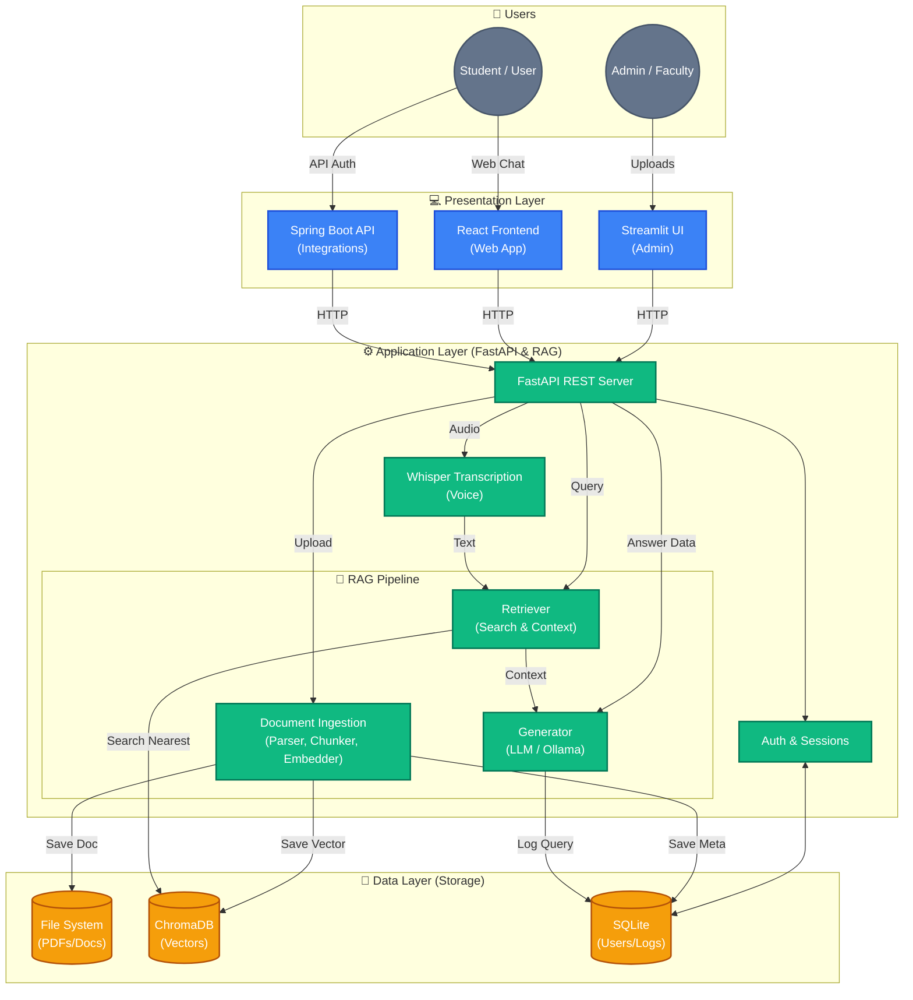
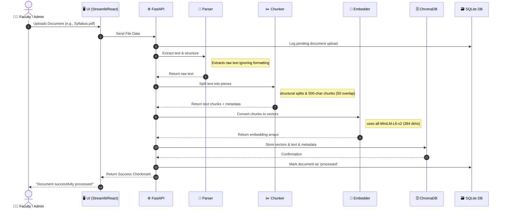
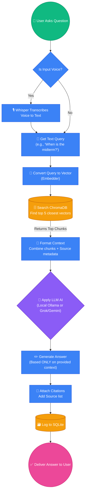

# AstroBot Data Flow Diagrams

These Mermaid diagrams illustrate the core data flows of the AstroBot system. You can copy the code blocks below and paste them into [Mermaid Live Editor](https://mermaid.live/), Notion, or PPT plugins to generate visual diagrams for your presentation.

## 1. Complete System Architecture & Data Flow overview 

This high-level diagram shows how all the components of the three-tier architecture communicate.

---

## 2. Document Upload (Ingestion) Flow

This diagram explains the step-by-step process of what happens when a document is uploaded. This is the **Preparation Phase**.

---

## 3. User Query & Retrieval (RAG) Flow

This diagram is great for showing how the Bot answers questions based on existing knowledge.

